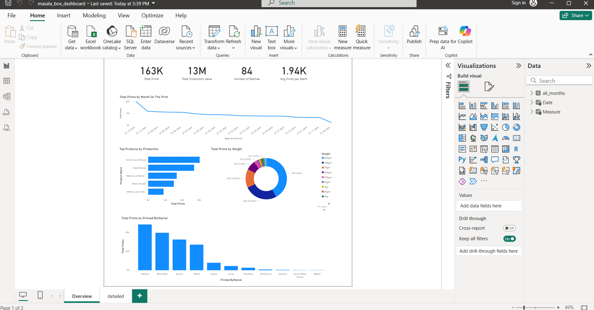
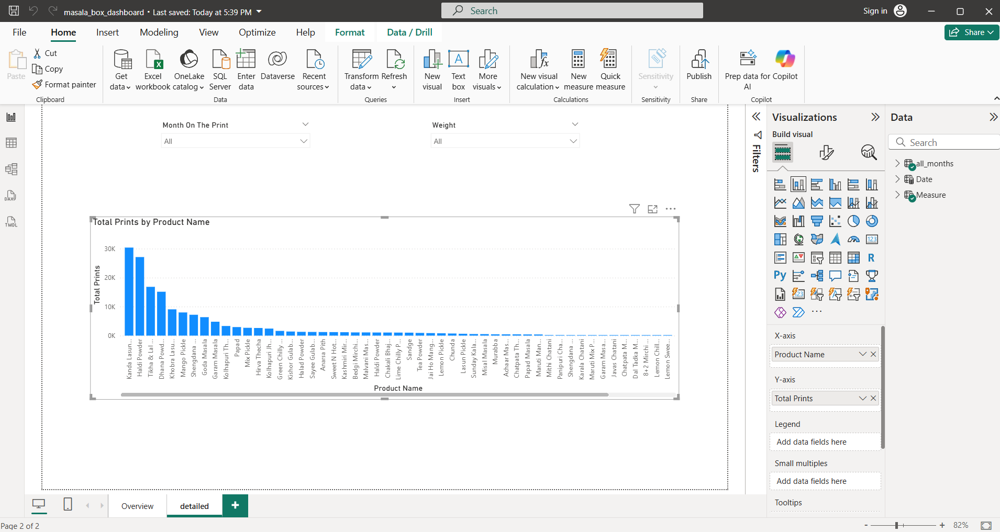

# 📊 Masala Box Dashboard

The **Masala Box Dashboard** is a Power BI solution designed to monitor and analyze production and printing data of spice products.  
It provides both **overview** and **detailed** insights into total prints, product performance, weight distribution, and operator efficiency.

---

## 🚀 Features

### 1. Overview Page
- **KPIs**:
  - Total Prints
  - Total Production Value
  - Number of Batches
  - Average Prints per Batch
- **Visuals**:
  - Total Prints by Month  
  - Top Products by Production  
  - Total Prints by Weight (Donut Chart)  
  - Total Prints by Operator  

### 2. Detailed Page
- **Visual**:
  - Total Prints by Product Name (ranked bar chart)

### 3. Filters
- **Month on the Print**
- **Weight**

These filters allow end-users to drill down into specific time periods or packaging weights.

---

## 🧹 Data Cleaning & Transformation

The source data was initially available in **one Excel file** containing sales data for all months combined.  

### Steps Performed:
1. **Initial Cleanup**  
   - Removed blank rows and unnecessary columns.  
   - Standardized column names (e.g., `Product Name`, `Weight`, `Total Prints`, `Month`).  
   - Converted data types (dates, numeric values).

2. **Splitting by Month**  
   - Using Power Query in Power BI (or Excel VBA/Python if needed), the single file was transformed into **separate files**, each representing a **single month’s sales data**.  
   - Naming convention:  
     ```
     Jan_2025.xlsx
     Feb_2025.xlsx
     Mar_2025.xlsx
     ...
     ```
   - This modular approach makes it easier for clients to update/replace data month by month.

3. **Parameter for Data Source**  
   - A **parameter** (`FileLocation`) was created in Power BI to dynamically fetch the correct monthly file.  
   - Clients can update the file path to point to a specific month’s dataset.

---

## 📂 Data Source Parameter Setup

To make this dashboard portable and allow clients to connect to their own data files, a **parameter** has been created in Power BI.

### Steps to Configure:
1. Open the Power BI file (`masala_box_dashboard.pbix`).
2. Go to **Home > Transform Data > Manage Parameters**.
3. Update the parameter **`FileLocation`**:
   - Enter the full path to your monthly data file (e.g., `C:\Users\YourName\Documents\Sales_Jan2025.xlsx`).
4. Save changes and click **Apply**.
5. Refresh the dataset to load data from the specified file location.

---

## 📸 Dashboard Previews

### Overview Page


### Detailed Page


---

## 🔧 Requirements
- Power BI Desktop (latest version recommended)
- Monthly Excel/CSV data files in the same schema
- Correctly configured file path parameter (`FileLocation`)

---

## 📌 Notes
- The dashboard is optimized for **production monitoring** of spice products.
- Ensure that each monthly file has the same structure (columns & data types).
- If your schema changes, update the **Power Query transformations** accordingly.
- Clients can maintain their dataset by simply adding/replacing the monthly file in the specified folder.

---
